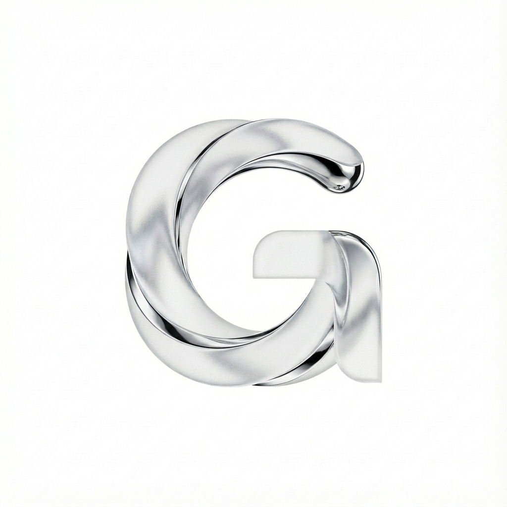

# 🏋️ GIGI - AI Personal Trainer

<p align="center">
  
</p>

<p align="center">
  <strong>Il tuo Personal Trainer AI intelligente, sempre al tuo fianco.</strong><br>
  Flutter + Laravel + OpenAI + ElevenLabs + Google Gemini
</p>

---

## 📋 Indice

1. [Panoramica](#-panoramica)
2. [Stack Tecnologico](#-stack-tecnologico)
3. [Architettura](#-architettura)
4. [Funzionalità Complete](#-funzionalità-complete)
5. [Frontend (Flutter)](#-frontend-flutter)
6. [Backend (Laravel)](#-backend-laravel)
7. [Integrazioni AI](#-integrazioni-ai)
8. [Setup & Installazione](#-setup--installazione)
9. [API Reference](#-api-reference)
10. [Database Schema](#-database-schema)

---

## 🎯 Panoramica

**GIGI** è un'applicazione fitness completa che combina intelligenza artificiale avanzata con un'esperienza utente premium. L'app offre:

- 🤖 **AI Voice Coaching** - Coach vocale in tempo reale con ElevenLabs TTS
- 📊 **Piani di Allenamento Personalizzati** - Generati con OpenAI GPT-4
- 🎥 **Analisi della Forma** - Video analysis con Google Gemini Pro Vision
- 🍎 **Nutrizione AI** - Analisi foto cibo, ricette personalizzate, tracking macros
- 🏆 **Gamification Avanzata** - Punti, streak, achievement, leaderboard
- 📈 **Progress Tracking** - Grafici, foto confronto, record personali

---

## 🛠 Stack Tecnologico

### Frontend
| Tecnologia | Versione | Uso |
|------------|----------|-----|
| Flutter | 3.31.0+ | Framework UI cross-platform |
| Dart | 3.7+ | Linguaggio di programmazione |
| Provider | 6.x | State management |
| AudioPlayers | 6.x | Riproduzione audio TTS |
| Google Fonts | 6.x | Typography (Inter, Outfit) |

### Backend
| Tecnologia | Versione | Uso |
|------------|----------|-----|
| Laravel | 11.x | Framework PHP |
| PHP | 8.2+ | Linguaggio backend |
| MySQL | 8.x | Database relazionale |
| Redis | 7.x | Caching & Queue |
| Filament | 3.x | Admin Panel |

### AI & Servizi Esterni
| Servizio | Uso |
|----------|-----|
| OpenAI GPT-4o | Generazione workout, nutrition insights |
| ElevenLabs | Text-to-Speech italiano naturale |
| Google Gemini Pro | Video analysis per form check |

---

## 🏗 Architettura

```
┌─────────────────────────────────────────────────────────────┐
│                      FLUTTER APP                            │
│  ┌─────────────┐  ┌─────────────┐  ┌─────────────────────┐  │
│  │   Screens   │  │   Widgets   │  │      Providers      │  │
│  │   (24+)     │  │   (50+)     │  │   (6 + Services)    │  │
│  └──────┬──────┘  └──────┬──────┘  └──────────┬──────────┘  │
│         │                │                     │            │
│  ┌──────┴────────────────┴─────────────────────┴─────────┐  │
│  │                    Data Services (18)                 │  │
│  │  auth, workout, nutrition, voice_coaching, etc.       │  │
│  └───────────────────────────┬───────────────────────────┘  │
│                              │ HTTPS/REST                   │
└──────────────────────────────┼──────────────────────────────┘
                               │
┌──────────────────────────────┼──────────────────────────────┐
│                      LARAVEL API                            │
│                              │                              │
│  ┌───────────────────────────┴───────────────────────────┐  │
│  │                 API Controllers (23)                  │  │
│  │   Auth, Workout, Nutrition, VoiceCoaching, etc.       │  │
│  └───────────────────────────┬───────────────────────────┘  │
│                              │                              │
│  ┌───────────────────────────┴───────────────────────────┐  │
│  │                   Services (17)                       │  │
│  │  OpenAI, ElevenLabs, Gemini, Gamification, etc.       │  │
│  └───────────────────────────┬───────────────────────────┘  │
│                              │                              │
│  ┌───────────────────────────┴───────────────────────────┐  │
│  │              Eloquent Models (41)                     │  │
│  │  User, WorkoutPlan, Meal, Exercise, etc.              │  │
│  └───────────────────────────┬───────────────────────────┘  │
│                              │                              │
│                        ┌─────┴─────┐                        │
│                        │   MySQL   │                        │
│                        └───────────┘                        │
└─────────────────────────────────────────────────────────────┘
```

---

## 🌟 Funzionalità Complete

### 1. 🎙️ GIGI Voice Coaching

Il cuore dell'app: un coach AI che parla in italiano naturale durante l'allenamento.

**Funzionalità:**
- **Saluto personalizzato** basato su ora del giorno, streak, obiettivi
- **Guida all'esercizio "Esegui con Gigi"** - spiegazione passo-passo
- **Conteggio serie e ripetizioni** vocale
- **Incoraggiamenti** durante rest e completamento
- **Speech rate ottimizzato** per comprensione

**Tecnologie:**
- `ElevenLabsService.php` - TTS API italiana
- `OpenAIService.php` - Generazione script coaching
- `SynchronizedVoiceController.dart` - Orchestrazione frontend
- `GigiTTSService.dart` - Riproduzione audio

**Parametri TTS:**
```php
'voice_settings' => [
    'stability' => 0.85,
    'similarity_boost' => 0.60,
    'speed' => 0.92,
]
```

---

### 2. 🏋️ Workout System

Sistema completo di gestione allenamenti.

**Features:**
- **Piano settimanale AI** - generato da GPT-4 basato su obiettivi
- **Sessione immersiva** - UI full-screen focus sull'esercizio corrente
- **Timer rest** con countdown vocale
- **Logging serie** - peso, reps, RPE
- **Workout personalizzati** - crea il tuo allenamento

**Schermate:**
```
lib/presentation/screens/workout/
├── workout_screen.dart              # Lista workout
├── workout_session_screen.dart      # Sessione attiva
├── immersive_session_screen.dart    # Modalità focus
├── rest_timer_screen.dart           # Timer riposo
├── workout_completed_screen.dart    # Riepilogo
└── custom_workout/                  # Workout custom
    ├── create_custom_workout_screen.dart
    ├── exercise_search_screen.dart
    └── select_day_screen.dart
```

**API Endpoints:**
| Endpoint | Metodo | Descrizione |
|----------|--------|-------------|
| `/workout-plans/generate` | POST | Genera piano AI |
| `/workout-plans/current` | GET | Piano attivo |
| `/workout-logs/start` | POST | Inizia sessione |
| `/workout-logs/{id}/complete` | POST | Completa sessione |
| `/set-logs` | POST | Logga serie |

---

### 3. 🍎 Nutrizione AI

Sistema nutrizionale completo con AI.

**Features:**
- **Calcolo TDEE automatico** basato su allenamenti
- **Tracking macros** - proteine, carbs, grassi
- **Log pasti** manuale o foto
- **Analisi foto cibo AI** - riconosce alimenti da foto
- **Ricette AI** - "Cosa cucino con questi ingredienti?"
- **Smart suggestions** - suggerimenti basati su macros rimanenti
- **Water tracking** - monitoraggio idratazione

**Controller Endpoints (30+):**
```php
// Goals
GET    /nutrition/goals
POST   /nutrition/goals
POST   /nutrition/goals/comprehensive

// Meals
POST   /nutrition/meals
GET    /nutrition/meals
PUT    /nutrition/meals/{id}
DELETE /nutrition/meals/{id}

// Analysis
GET    /nutrition/daily-summary
GET    /nutrition/weekly-summary
GET    /nutrition/insights
POST   /nutrition/quick-log          # Foto AI analysis

// TDEE
POST   /nutrition/calculate-tdee

// Recipes
GET    /nutrition/recipes
POST   /nutrition/what-to-cook       # AI recipes

// Suggestions
GET    /nutrition/smart-suggestions
```

**AI Photo Analysis Flow:**
```
User uploads photo → OpenAI Vision analyzes → 
Returns: food items, estimated macros, portions →
User confirms/edits → Meal logged
```

---

### 4. 🎥 Form Analysis (AI Video Check)

Analisi della tecnica tramite video.

**Features:**
- **Upload video** max 15 secondi
- **AI analysis** con Google Gemini Pro Vision
- **Punteggio forma** 0-100
- **Errori rilevati** con timestamp
- **Suggerimenti correttivi**
- **Quota giornaliera** (Free: 2/giorno, Premium: illimitato)

**Flow:**
```
1. User records exercise video (max 15s)
2. Upload to backend
3. Gemini Pro Vision analyzes
4. Returns:
   - form_score: 85
   - detected_errors: ["Knees caving", "Back rounding"]
   - suggestions: ["Keep knees out", "Brace core"]
   - summary: "Good overall form with minor issues"
```

**API:**
```php
POST   /form-analysis/analyze   # Submit video
GET    /form-analysis/quota     # Check daily quota
GET    /form-analysis/history   # Past analyses
GET    /form-analysis/{id}      # Specific analysis
DELETE /form-analysis/{id}      # Delete
```

---

### 5. 🏆 Gamification

Sistema di progressione e competizione.

**Features:**
- **Punti XP** per ogni azione
- **Livelli** con progressione
- **Streak giorni consecutivi**
- **Achievement** sbloccabili
- **Leaderboard** classifica settimanale
- **Sfide settimanali**

**Achievement Categories:**
| Categoria | Esempi |
|-----------|--------|
| Workout | "Prima sessione", "10 workout", "100 workout" |
| Streak | "7 giorni", "30 giorni", "100 giorni" |
| Weight | "Primo PR", "10 PR", "Solleva 100kg" |
| Social | "Primo amico", "10 condivisioni" |

**Points System:**
```php
'workout_completed' => 100,
'streak_7_days' => 500,
'new_pr' => 200,
'form_analysis' => 50,
```

---

### 6. 📈 Progress Tracking

Monitoraggio progressi dettagliato.

**Features:**
- **Grafici peso/misure** nel tempo
- **Foto confronto** before/after
- **Record personali** per esercizio
- **Statistiche workout** (volume, frequenza)
- **Muscle group heatmap**

**Schermate:**
```
lib/presentation/screens/progress/
├── progress_dashboard_screen.dart   # Dashboard principale
├── progress_photos_screen.dart      # Galleria foto
├── progress_comparison_screen.dart  # Confronto foto
├── body_measurements_screen.dart    # Misure corporee
├── personal_records_screen.dart     # PR history
└── muscle_progress_screen.dart      # Progressi per muscolo
```

---

### 7. 👤 User Management

Gestione profilo completa.

**Features:**
- **Registrazione/Login** email + password
- **Social Login** Google, Apple
- **Profilo dettagliato** (obiettivi, livello, misure)
- **Questionario iniziale** per personalizzazione
- **Impostazioni privacy** (GDPR compliant)
- **Subscription management**

**User Profile Fields:**
```dart
- height, weight, age, gender
- fitness_goal: (muscle_gain, weight_loss, toning, etc.)
- experience_level: (beginner, intermediate, advanced)
- available_days, available_equipment
- health_conditions, injuries
```

---

### 8. 🔔 Engagement & Notifications

Sistema di engagement utente.

**Features:**
- **Push notifications** per reminder allenamento
- **Smart notifications** basate su comportamento
- **Weekly summary** email
- **Streak reminders** per mantenere serie
- **Social engagement** (likes, commenti, sfide)

---

### 9. 📱 Social Features

Funzionalità social.

**Features:**
- **Feed attività** amici
- **Condivisione workout** completati
- **Sfide 1v1** o di gruppo
- **Leaderboard** settimanale/mensile
- **Commenti e reactions**

---

## 📱 Frontend (Flutter)

### Struttura Directory

```
lib/
├── core/
│   ├── constants/
│   │   ├── api_config.dart        # URL API, endpoints
│   │   └── app_constants.dart     # Constanti app
│   ├── services/
│   │   ├── synchronized_voice_controller.dart  # Voice coaching brain
│   │   ├── gigi_tts_service.dart               # Audio playback
│   │   ├── coaching_phrases_database.dart      # Frasi coaching
│   │   ├── exercise_scripts_database.dart      # Script esercizi
│   │   ├── audio_manager.dart                  # Suoni UI
│   │   ├── haptic_service.dart                 # Vibrazioni
│   │   ├── notification_service.dart           # Push notifications
│   │   └── payment_service.dart                # RevenueCat
│   └── theme/
│       └── clean_theme.dart       # Design system
│
├── data/
│   ├── models/                    # Modelli dati (20+)
│   │   ├── user_model.dart
│   │   ├── workout_model.dart
│   │   ├── exercise_model.dart
│   │   ├── meal_model.dart
│   │   └── ...
│   └── services/                  # API services (18)
│       ├── api_client.dart        # HTTP client base
│       ├── auth_service.dart
│       ├── workout_service.dart
│       ├── nutrition_service.dart
│       ├── voice_coaching_service.dart
│       └── ...
│
├── presentation/
│   ├── screens/                   # Schermate (24 moduli)
│   │   ├── auth/
│   │   ├── home/
│   │   ├── workout/
│   │   ├── nutrition/
│   │   ├── progress/
│   │   ├── gamification/
│   │   ├── profile/
│   │   └── ...
│   └── widgets/                   # Widget riutilizzabili
│       ├── clean_widgets.dart     # Component library
│       ├── voice_coaching/        # UI voice coaching
│       └── workout/               # Widget workout
│
├── providers/                     # State management (6)
│   ├── auth_provider.dart
│   ├── workout_provider.dart
│   ├── workout_log_provider.dart
│   ├── gamification_provider.dart
│   ├── engagement_provider.dart
│   └── social_provider.dart
│
└── main.dart                      # Entry point
```

### Design System (CleanTheme)

```dart
// Colori principali
static const primaryColor = Color(0xFF6366F1);    // Indigo
static const accentGreen = Color(0xFF10B981);     // Success
static const accentRed = Color(0xFFEF4444);       // Error
static const backgroundColor = Color(0xFFF8FAFC); // Light gray

// Tipografia
- Outfit: Headers
- Inter: Body text
- Google Fonts

// Componenti
- CleanCard, CleanButton, CleanTextField
- CleanProgressBar, CleanChip
- CleanBottomSheet, CleanDialog
```

---

## 🖥 Backend (Laravel)

### Struttura Directory

```
app/
├── Console/                       # Artisan commands
│   └── Commands/
│
├── Http/
│   ├── Controllers/
│   │   └── Api/                   # API Controllers (23)
│   │       ├── AuthController.php
│   │       ├── WorkoutPlanController.php
│   │       ├── WorkoutLogController.php
│   │       ├── ExerciseController.php
│   │       ├── VoiceCoachingController.php
│   │       ├── NutritionController.php
│   │       ├── FormAnalysisController.php
│   │       ├── GamificationController.php
│   │       ├── SocialController.php
│   │       ├── ProgressController.php
│   │       └── ...
│   └── Middleware/
│
├── Models/                        # Eloquent Models (41)
│   ├── User.php
│   ├── UserProfile.php
│   ├── WorkoutPlan.php
│   ├── WorkoutDay.php
│   ├── WorkoutExercise.php
│   ├── Exercise.php
│   ├── WorkoutLog.php
│   ├── SetLog.php
│   ├── ExerciseLog.php
│   ├── Meal.php
│   ├── NutritionGoal.php
│   ├── Recipe.php
│   ├── ExerciseFormAnalysis.php
│   ├── Achievement.php
│   ├── PersonalRecord.php
│   ├── ProgressPhoto.php
│   └── ...
│
├── Services/                      # Business Logic (17)
│   ├── OpenAIService.php         # 105KB - GPT integrations
│   ├── ElevenLabsService.php     # TTS generation
│   ├── GeminiFormAnalysisService.php  # Video analysis
│   ├── NutritionService.php      # Nutrition logic
│   ├── GamificationService.php   # Points & achievements
│   ├── AdaptiveTrainingService.php    # Progressive overload
│   ├── CoachingScriptGenerator.php    # Voice scripts
│   ├── SubscriptionManagementService.php  # Entitlements
│   └── ...
│
└── Filament/                      # Admin Panel
    └── Resources/
```

### API Routes Overview

```php
// routes/api.php

Route::prefix('auth')->group(function () {
    Route::post('register', [AuthController::class, 'register']);
    Route::post('login', [AuthController::class, 'login']);
    Route::post('social-login', [AuthController::class, 'socialLogin']);
});

Route::middleware('auth:sanctum')->group(function () {
    // Workout Plans
    Route::apiResource('workout-plans', WorkoutPlanController::class);
    Route::post('workout-plans/generate', [WorkoutPlanController::class, 'generate']);
    
    // Workout Logs
    Route::post('workout-logs/start', [WorkoutLogController::class, 'start']);
    Route::post('workout-logs/{id}/complete', [WorkoutLogController::class, 'complete']);
    Route::apiResource('set-logs', SetLogController::class);
    
    // Exercises
    Route::get('exercises', [ExerciseController::class, 'index']);
    Route::get('exercises/{id}', [ExerciseController::class, 'show']);
    Route::get('exercises/{id}/history', [ExerciseHistoryController::class, 'show']);
    
    // Voice Coaching
    Route::prefix('voice-coaching')->group(function () {
        Route::post('text-to-speech', [VoiceCoachingController::class, 'textToSpeech']);
        Route::post('generate-script', [VoiceCoachingController::class, 'generateGuidedScript']);
    });
    
    // Nutrition
    Route::prefix('nutrition')->group(function () {
        Route::get('goals', [NutritionController::class, 'getGoals']);
        Route::post('goals', [NutritionController::class, 'setGoals']);
        Route::apiResource('meals', MealController::class);
        Route::post('quick-log', [NutritionController::class, 'quickLog']);
        Route::post('calculate-tdee', [NutritionController::class, 'calculateTDEE']);
        Route::post('what-to-cook', [NutritionController::class, 'whatToCook']);
    });
    
    // Form Analysis
    Route::prefix('form-analysis')->group(function () {
        Route::post('analyze', [FormAnalysisController::class, 'analyze']);
        Route::get('quota', [FormAnalysisController::class, 'checkQuota']);
        Route::get('history', [FormAnalysisController::class, 'history']);
    });
    
    // Gamification
    Route::get('gamification/stats', [GamificationController::class, 'stats']);
    Route::get('gamification/achievements', [GamificationController::class, 'achievements']);
    Route::get('gamification/leaderboard', [GamificationController::class, 'leaderboard']);
    
    // Progress
    Route::get('progress/stats', [ProgressController::class, 'stats']);
    Route::get('progress/personal-records', [ProgressController::class, 'personalRecords']);
    Route::apiResource('progress-photos', ProgressPhotoController::class);
});
```

---

## 🤖 Integrazioni AI

### OpenAI Service (OpenAIService.php)

Il servizio più complesso (~105KB) gestisce tutte le interazioni con GPT-4.

**Capabilities:**
```php
// Workout Generation
generateWorkoutPlan($userProfile, $preferences)
generateAdaptiveWorkout($user, $performanceData)

// Voice Coaching Scripts
generateGuidedExecution($exercise, $userProfile)
generateExerciseExplanation($exercise)

// Nutrition
analyzeFood($imageBase64)              // Photo → macros
generateRecipes($ingredients, $macros)  // AI chef
getSmartMealSuggestions($remainingMacros)

// Form Analysis Helper
generateFormFeedback($analysisResult)
```

### ElevenLabs Service (ElevenLabsService.php)

Text-to-Speech italiano naturale.

```php
$elevenLabs->generateSpeechWithTimestamps($text)
// Returns:
// - audio_url: MP3 file
// - word_timestamps: for lip-sync

$elevenLabs->generateSpeechOnly($text)
// Returns: audio_url only (cheaper)
```

**Voice Settings:**
```php
'voice_id' => 'italian_male_voice',  // Configured
'model_id' => 'eleven_multilingual_v2',
'voice_settings' => [
    'stability' => 0.85,
    'similarity_boost' => 0.60,
    'speed' => 0.92,
]
```

### Gemini Form Analysis (GeminiFormAnalysisService.php)

Video analysis per form check.

```php
$gemini->analyzeExerciseForm($user, $videoPath, $exerciseName)
// Returns:
// - form_score: 0-100
// - detected_errors: ["Error 1", "Error 2"]
// - suggestions: ["Fix 1", "Fix 2"]
// - summary: "Overall feedback"
// - processing_time_ms: 2500
```

---

## 🚀 Setup & Installazione

### Prerequisites

- Flutter 3.31+
- PHP 8.2+
- Composer
- MySQL 8+
- Node.js 18+ (for asset compilation)
- API Keys: OpenAI, ElevenLabs, Google Cloud (Gemini)

### Backend Setup

```bash
# Clone repository
cd Gest_One

# Install dependencies
composer install

# Environment setup
cp .env.example .env

# Configure .env
OPENAI_API_KEY=sk-...
ELEVENLABS_API_KEY=...
GEMINI_API_KEY=...

# Database
php artisan migrate
php artisan db:seed

# Start server
php artisan serve
```

### Frontend Setup

```bash
# Clone repository
cd GIGI

# Get dependencies
flutter pub get

# Configure API URL
# Edit lib/core/constants/api_config.dart
static const String baseUrl = 'https://your-api.com/api/';

# Run
flutter run -d chrome  # Web
flutter run            # Mobile
```

### Build Production

```bash
# Web
flutter build web --release

# Android
flutter build apk --release

# iOS
flutter build ipa --release
```

---

## 📊 Database Schema

### Core Tables

```sql
-- Users & Profiles
users (id, name, email, password, subscription_type, ...)
user_profiles (id, user_id, height, weight, goal, experience_level, ...)

-- Workouts
workout_plans (id, user_id, name, status, weeks, ...)
workout_days (id, plan_id, name, focus, estimated_duration, ...)
workout_exercises (id, day_id, exercise_id, sets, reps, rest_seconds, ...)
exercises (id, name, muscle_groups, equipment, instructions, ...)

-- Logging
workout_logs (id, user_id, workout_day_id, started_at, completed_at, ...)
exercise_logs (id, workout_log_id, exercise_id, ...)
set_logs (id, exercise_log_id, set_number, weight, reps, rpe, ...)

-- Nutrition
nutrition_goals (id, user_id, calories, protein, carbs, fat, ...)
meals (id, user_id, meal_type, foods, total_calories, ...)
daily_nutrition_logs (id, user_id, date, water_ml, ...)
recipes (id, name, ingredients, instructions, macros, ...)

-- Progress
progress_photos (id, user_id, photo_path, category, ...)
body_measurements (id, user_id, weight, chest, waist, ...)
personal_records (id, user_id, exercise_id, weight, reps, ...)

-- Gamification
user_stats (id, user_id, total_xp, level, current_streak, ...)
achievements (id, name, description, xp_reward, ...)
user_achievements (id, user_id, achievement_id, unlocked_at, ...)

-- AI Features
exercise_form_analyses (id, user_id, video_path, form_score, feedback, ...)
exercise_audio_cache (id, exercise_id, script_hash, audio_path, ...)
```

---

## 📝 License

Proprietary - © 2024 GIGI Fitness

---

## 👥 Team

- **Development**: Full-stack AI Application
- **AI Integration**: OpenAI GPT-4, ElevenLabs, Google Gemini
- **Design**: Clean Design System with Flutter

---

<p align="center">
  <strong>Made with ❤️ for fitness enthusiasts</strong>
</p>
